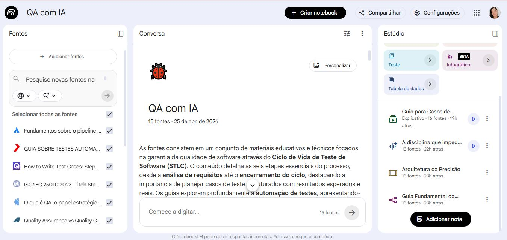

# 🤖 QA com Inteligência Artificial

### Como usar IA no dia a dia de um QA (Manual Testing + IA)

---

## 🎯 Contexto e Objetivo

Este projeto tem como objetivo demonstrar, na prática, como a Inteligência Artificial pode ser utilizada como ferramenta de apoio no dia a dia de um profissional de QA (Quality Assurance), especialmente em testes manuais.

O foco é mostrar como a IA pode auxiliar na:
- Criação de casos de teste
- Geração de cenários positivos e negativos
- Identificação de possíveis bugs
- Melhoria na escrita de defeitos

---

## 📚 Curadoria de Fontes

As fontes abaixo foram utilizadas no **NotebookLM** para construção do conhecimento. Cada uma contribuiu de forma específica:

| Fonte | Tipo | Por que usei? |
|-------|------|----------------|
| [SauceDemo](https://www.saucedemo.com/) | Ambiente real de teste | Aplicação prática para validar cenários de login e fluxo de compra |
| [Guru99](https://www.guru99.com/software-testing.html) | Tutorial teórico | Base sólida sobre tipos de teste e boas práticas |
| [BrowserStack](https://www.browserstack.com/guide/what-is-software-testing) | Guia da indústria | Contexto sobre testes manuais vs automatizados |
| [Atlassian](https://www.atlassian.com/continuous-delivery/software-testing) | Documentação técnica | Exemplos de fluxos de teste e geração de casos |

---

## 📸 Evidência do uso do NotebookLM

Durante o desenvolvimento deste projeto, utilizei o **NotebookLM** para:
- Organizar fontes de estudo (PDFs, sites e textos)
- Explorar conteúdos com apoio da IA
- Gerar resumos, perguntas essenciais e casos de teste

### 🖥️ Print do ambiente utilizado

Abaixo, um print mostrando o NotebookLM com as fontes carregadas e um prompt em ação:

> *Nota: a imagem acima ilustra o ambiente real do projeto.*

---

## 🧪 Engenharia de Prompts e "Cicatrizes"

### 🔹 Prompt inicial (genérico)

> "Crie casos de teste para uma tela de login com usuário e senha"

**Problema encontrado:**
A resposta foi muito genérica e não cobriu todos os cenários necessários para um teste completo.

---

### 🔹 Prompt melhorado

> "Crie casos de teste detalhados para uma tela de login com usuário e senha, incluindo cenários positivos e negativos"

**Resultado:**
A IA gerou casos mais completos, incluindo validações e possíveis falhas.

---

### 🔹 Prompt avançado (com contexto real)

> "Crie casos de teste detalhados para o login do SauceDemo, incluindo:
> - Cenários positivos
> - Cenários negativos
> - Validação de campos obrigatórios
> - Mensagens de erro esperadas"

**Resultado:**
A resposta foi mais próxima de um cenário real de QA, com maior qualidade e aplicabilidade.

---

### ⚠️ Cicatriz (erro da IA) – com exemplo concreto

A IA sugeriu um cenário que **não existe** no sistema testado.

**Exemplo real do erro:**
> A IA gerou o seguinte caso de teste:  
> *"CT-IA-09: Tentar login com CPF inválido – sistema deve exibir mensagem 'CPF não cadastrado'"*

**Problema:**  
O site **SauceDemo** não possui campo de CPF. O login é feito apenas com `username` e `password`. A IA inventou essa validação baseada em contextos genéricos de outros sistemas.

**Aprendizado:**  
A IA não substitui o QA. Todas as respostas devem ser analisadas e validadas com pensamento crítico. O conhecimento do domínio do sistema é indispensável.

---

## 🧪 Exemplo prático com IA (SauceDemo)

**Sistema utilizado:** [https://www.saucedemo.com/](https://www.saucedemo.com/)

### 🧾 Caso de teste completo gerado pela IA (prompt avançado)

Abaixo, um exemplo real de caso de teste gerado pelo NotebookLM após o prompt refinado:

| ID | Cenário | Pré-condição | Passos | Resultado esperado |
|----|---------|--------------|--------|--------------------|
| CT‑IA‑01 | Login com credenciais válidas | Acessar a página de login do SauceDemo | 1. Inserir `standard_user` no campo de usuário 2. Inserir `secret_sauce` no campo de senha 3. Clicar no botão "Login" | Redirecionamento para a página de inventário/produtos |
| CT‑IA‑02 | Usuário válido + senha inválida | Acessar a página de login | 1. Inserir `standard_user` 2. Inserir `senha_errada` 3. Clicar em "Login" | Mensagem de erro: "Username and password do not match any user in this service" |
| CT‑IA‑03 | Campos vazios | Acessar a página de login | 1. Deixar usuário e senha em branco 2. Clicar em "Login" | Mensagem de erro: "Username is required" |

**Análise crítica:**  
Todos os três casos foram validados manualmente no SauceDemo. Os cenários CT-IA-01 e CT-IA-02 estão 100% corretos. O CT-IA-03 também funciona, mas a mensagem real do sistema é ligeiramente diferente (`"Epic sadface: Username is required"`). A IA acertou a essência, mas o QA deve ajustar o texto exato.

---

## 📘 Miniguia de Estudo

### 📌 Resumo

A Inteligência Artificial pode acelerar o trabalho do QA, auxiliando na criação de cenários, organização dos testes e identificação de possíveis falhas.

No entanto, o QA continua sendo essencial para validar regras de negócio e garantir a qualidade real do sistema.

---

### 📖 Glossário

- **QA (Quality Assurance):** Garantia da qualidade do software  
- **Caso de Teste:** Passo a passo para validar uma funcionalidade  
- **Bug:** Falha no sistema  
- **Teste Manual:** Testes realizados sem automação  
- **Prompt:** Comando enviado para a IA  

---

### 🔁 Prompts Reutilizáveis

- `Crie casos de teste para [funcionalidade] (ex: login, cadastro)`
- `Liste cenários positivos e negativos para [funcionalidade]`
- `Sugira possíveis bugs para um sistema de [tipo] (ex: e-commerce, app bancário)`
- `Melhore a descrição deste bug: [cole aqui o bug]`

---

## 🚀 Conclusão

A Inteligência Artificial é uma ferramenta poderosa para apoiar o trabalho do QA, mas não substitui o raciocínio humano.

O diferencial está em saber utilizar a IA de forma estratégica, validando suas respostas e aplicando pensamento crítico.

---

## 👩‍💻 Autora

Flávia Paiva  
QA em formação | Testes Manuais | Casos de Teste | Identificação de Bugs 🐞

---

*Projeto desenvolvido como parte do desafio "QA com IA" – bootcamp DIO.*
